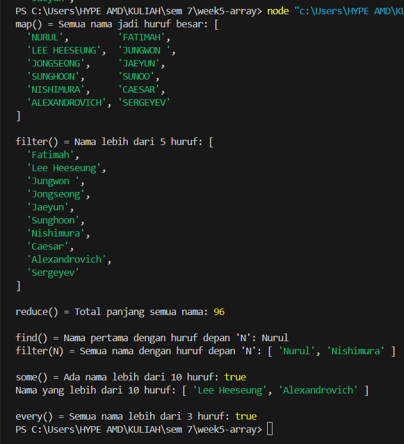

# Assignment 2 - Week 5: Array Function

## Identitas
- Nama : Nurul Fatimah
- NIM  : F1D022085

## Deskripsi Tugas
Tugas ini menerapkan enam metode penting array di JavaScript: **map(), filter(), reduce(), find(), some(), every()** dengan data array buatan sendiri yang berisi 10 elemen.

## Implementasi

### map()
- **Tujuan:** Mengubah semua nama di dalam array menjadi huruf besar.
- **Screenshot:**
.png)

### filter()
- **Tujuan:** Mengambil semua nama yang panjangnya lebih dari 5 huruf.
- **Screenshot:**
.png)

### reduce()
- **Tujuan:** Menghitung total panjang dari semua nama yang ada di array.
- **Screenshot:**
.png)

### find()
- **Tujuan:** Mencari satu nama yang huruf depannya sama dengan 'N'.
- **Screenshot:**
.png)

### some()
- **Tujuan:** Mengecek apakah ada nama dengan panjang lebih dari 10 huruf.
- **Screenshot:**
.png)

### every()
- **Tujuan:** Mengecek apakah semua nama di array memiliki panjang lebih dari 3 huruf.
- **Screenshot:**
.png)

## Kesimpulan
Setiap metode array memiliki kegunaan yang berbeda:
- `map()` untuk memodifikasi setiap elemen,
- `filter()` untuk menyaring elemen sesuai kondisi,
- `reduce()` untuk mengakumulasi hasil dari seluruh elemen,
- `find()` untuk mencari satu elemen pertama yang cocok,
- `some()` untuk mengecek apakah minimal ada satu elemen yang memenuhi syarat,
- `every()` untuk mengecek apakah semua elemen memenuhi syarat.

Dengan memahami perbedaan metode ini, kita bisa mengolah data array di JavaScript secara lebih efisien dan fleksibel.

